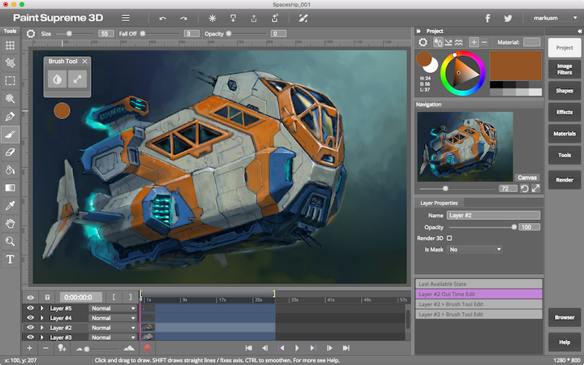

# About

> 

**ViralGraphics.io** is a new JavaScript / HTML5 application framework under the MIT license. It is specifically designed to enable Desktop like applications inside your browser and provides a wide range of widgets and layouts to generate complex and good looking user interfaces.

Main Features:

* ViralGraphics.io utilizes both the 2D and 3D canvas to draw it's widgets in the best possible quality and speed.
* Light-weight MVC model for automated undo / redo and data binding.
* Abstraction layers for commonly used WebGL classes, like shaders and drawing.
* Full featured backend which handles user and database functionality for applications. Each application has it's own database folders.
* Applications can be automatically published on the backend in viralgraphics.io/apps. Custom domains are possible.
* Electron support for Desktop builds. ViralGraphics.io applications have been successfully published to the Mac and Windows AppStores.

The showcase application for ViralGraphics.io is [PaintSupreme 3D](https://www.paintsupreme3d.com). It is available on the Web, as well as in native Windows, Mac and Linux versions. It is also available inside the Mac and Windows App Stores.

ViralGraphics.io is developed by employees of [BrainDistrict GmbH](https://www.braindistrict.com). The source is hosted on [GitHub](https://github.com/markusmoenig/viralgraphics.io). BrainDistrict may offer commercial support options for ViralGraphics.io in the future.

# Getting Started

> Installing and creating a project

```shell
npm install viralgraphics.io -g; # Install viralgraphics.io globally
viralgraphics.io new test; # Create a new project called test
cd test;
viralgraphics.io test.vg; # Compile it. After that launch the test.html file
```

viralgraphics.io is the nodejs [module](https://www.npmjs.com/package/viralgraphics.io) used to create and compile projects as well as uploading them to the backend.

Projects use makefiles with an .vg extension, the makefile has links to all the sources and media used by the project. viralgraphics.io compiles the makefile into a .vide file which is the "binary" format used by the project launcher.

After installing viralgraphics.io you can create a new project using the "new" command followed by the project name. You can optionally also supply the project template, one of "helloworld", "gamesample" and "demo". The default is "demo".

## Application Structure

> HelloWorld.js

```javascript
function vgMain( workspace, argc, arg )
{
    let label = new VG.UI.Label( "Hello World!");
    label.horizontalExpanding = true; // Center it horizontally

    workspace.content = new VG.UI.Layout( label );
};
```

Every ViralGraphics.io application has to have a global vgMain() function which serves as it's main entry point. You can see a short example of an _Hello World_ example on the right.

The content property of the ```VG.UI.Workspace``` object has to be set to the main widget or top layout used by the application.

You can see the _Hello World_ application in action [here](http://viralgraphics.io/apps/helloworld).

## Syntax of Makefiles

> Example Makefile

```
name = Demo Application
version = 0.31
url = demo-app
author = Markus Moenig

sources = main.js
sources = homepage.js, newspage.js

images = images/banner.png, images/logo_home.png

svg = svg/glyphs.svg, svg/socialglyphs.svg

html = html/About ViralGraphics.html, html/Features Overview.html
```

Parameters

* _name_ - Sets the name of the Application. Has to be defined when you want to create the application on the ViralGraphics.io server.
* _url_ - Sets the Url of the application inside the viralgraphics.io/apps/ directory (once published). Has to be defined when you want to create the application on ViralGraphics.io.
* _version_ - Sets the version string of the application.
* _author_ - Sets the author name of the application.
* _domain_ - Specifies an optional custom domain.
* _keywords_ - Keywords describing application functionality, will be inserted into the applications website meta-data once published.
* _title_ - Title of the application. Will be displayed in the browsers title bar once published.
* _description_ - Multi line description of the application.
* _webBorderColor_ - Specifies a custom web border color in CSS terms.

Content

* _sources_ - A comma separated list with links to the sources of the application. Several _sources_ lines can be specified.
* _images_ - A comma separated list with links to the images used by the application. Several _images_ lines can be specified. An image can be requested inside an application with VG.Utils.getImageByName( Filename ).
* _html_ - A comma separated list with links to the html or text files used by the application. Several _html_ lines can be specified. An html/text file can be requested inside an application with VG.Utils.getTextByName( Filename ).
* _svg_ - A comma separated list with links to the scalable vector files of the application. Several vector file lines can be specified. An SVG can be requested inside an application with VG.Utils.getSVGByName( Filename ).

# Fundamentals

## The Workspace

The workspace class ```VG.UI.Workspace``` provides all necessary information about the local environment to the application, like the available screenspace, it also provides various functions for customizations, like adding dock widgets. The workspace class is provided as the first argument in your vgMain() function. The ```content``` property of the workspace defines the main widget or layout of the application.

### Dock Widgets

Dock widgets can be attached to one of the sides of the Workspace.

This example adds a dock widget called "Text Edit" to the right of the Workspace, the dock widget only contains one item, a ```VG.UI.TextEdit```, you can of course add many more items to the dock widget.

```javascript
function vgMain( workspace, argc, arg )
{
    // --- Add a dock widget to the right containing a text edit
    let dockWidget = VG.UI.DockWidget( "Text Edit" );
    dockWidget.addItem( VG.UI.TextEdit() );

    workspace.addDockWidget( dockWidget, "Right" );
    workspace.content = new VG.UI.Widget();
};
```

